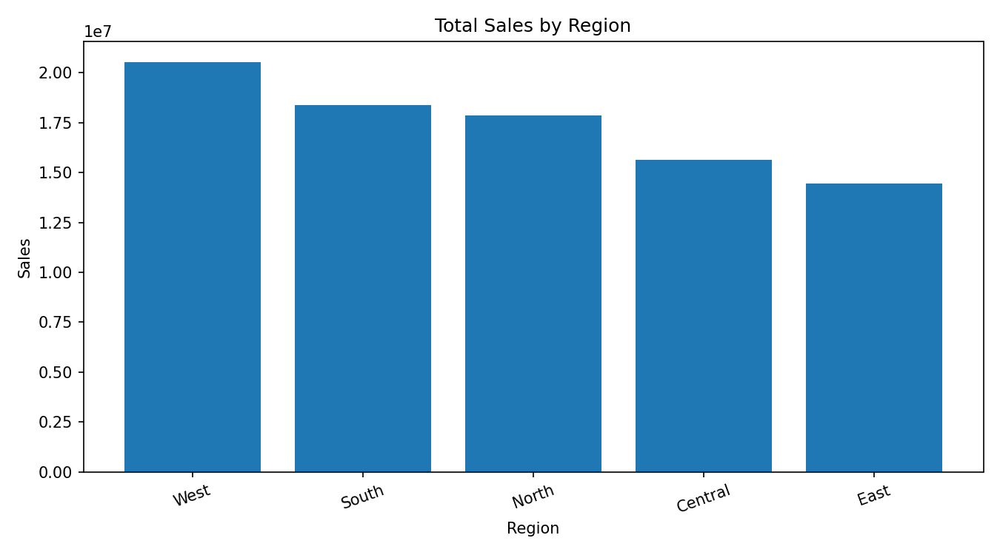
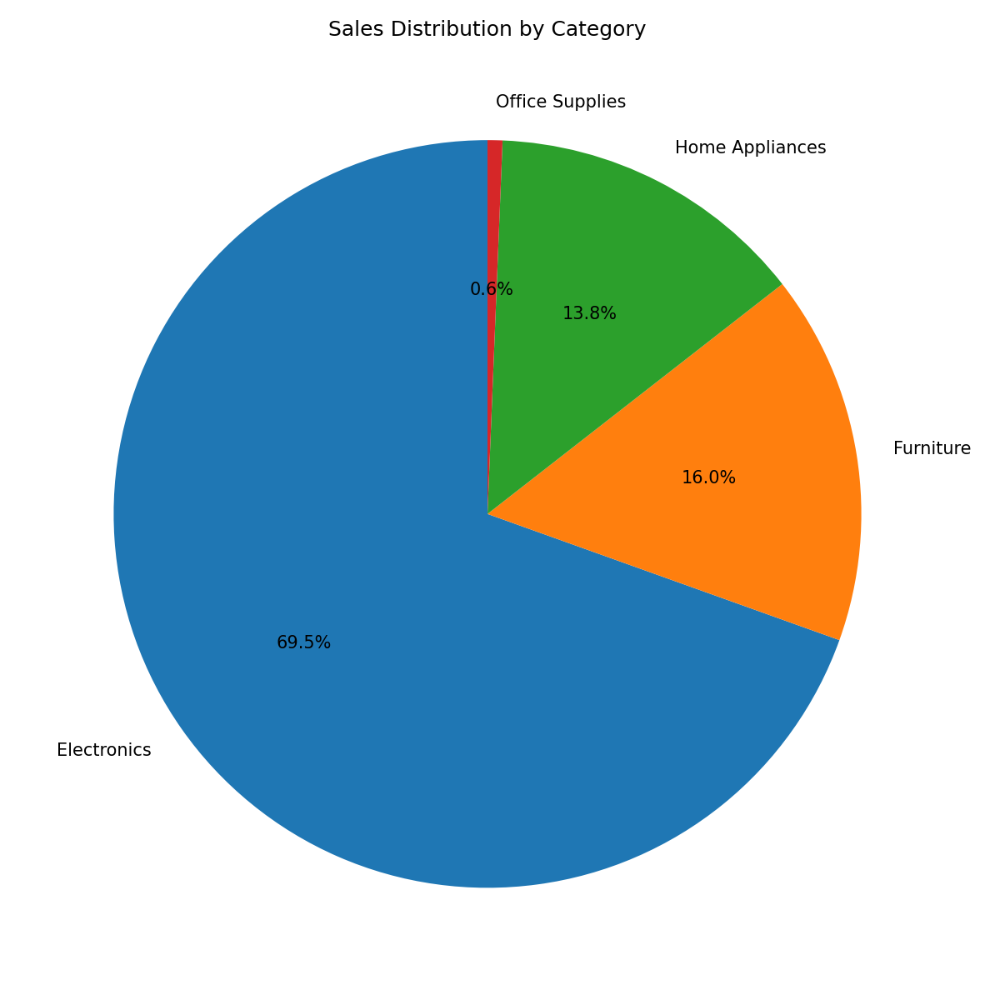
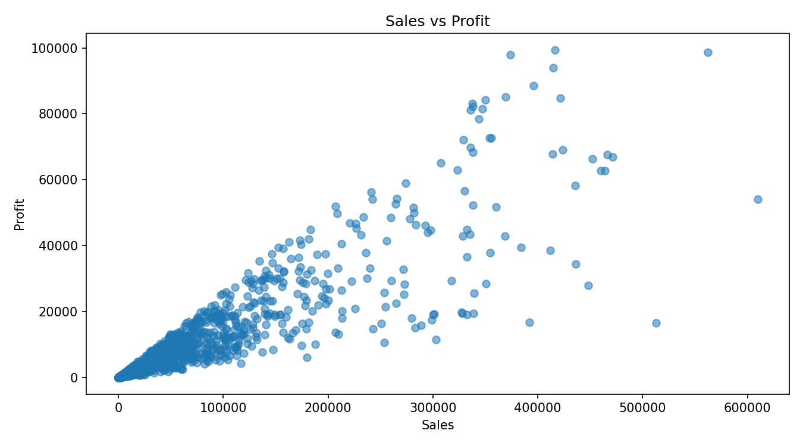
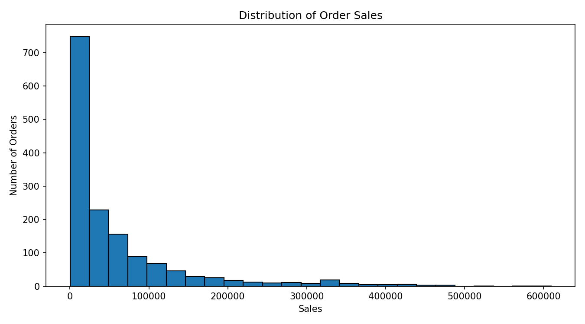
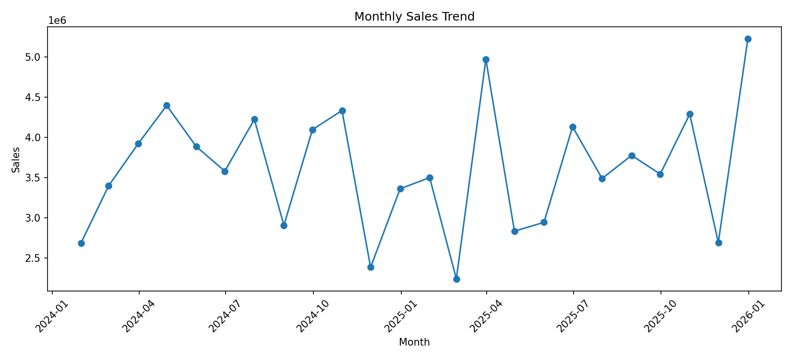
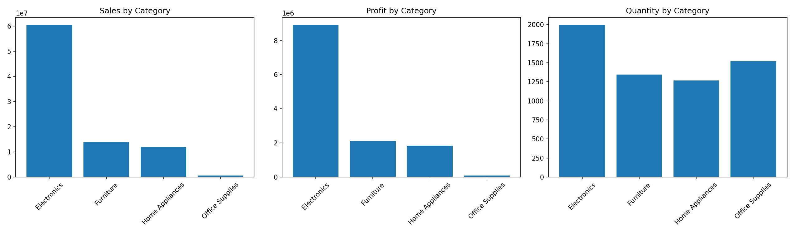
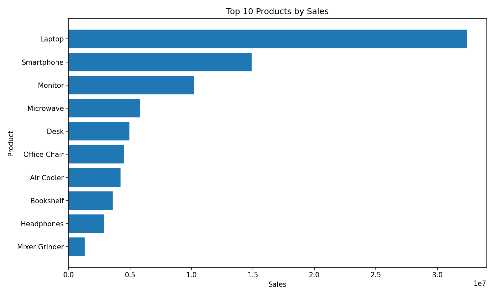

# 📊 Sales Data Analysis

A comprehensive sales data analysis and visualization project using **Python, Pandas, Matplotlib, and Seaborn**. The project explores sales performance, profitability, regional trends, product performance, category distribution, and monthly sales patterns through data analysis and visualization.

---

## 📌 Project Overview

This project analyzes a sales dataset to identify meaningful patterns and trends in business performance.

The analysis covers:

* Regional sales performance
* Category-wise sales distribution
* Relationship between sales and profit
* Sales value distribution
* Monthly sales trends
* Category-wise performance comparison
* Top-performing products

The complete analysis is available in the Jupyter Notebook included in this repository.

---

## 🎯 Objectives

The main objectives of this project are to:

* Understand overall sales performance
* Identify high-performing regions and categories
* Analyze the relationship between sales and profit
* Discover top-performing products
* Identify monthly sales trends
* Present insights through clear and informative visualizations

---

## 🛠️ Technologies Used

| Technology          | Purpose                        |
| ------------------- | ------------------------------ |
| 🐍 Python           | Data analysis and processing   |
| 🐼 Pandas           | Data manipulation and analysis |
| 📊 Matplotlib       | Data visualization             |
| 🎨 Seaborn          | Statistical visualization      |
| 📓 Jupyter Notebook | Analysis and documentation     |

---

## 📂 Project Structure

```text
Sales-Data-Analysis/
│
├── data/
│   └── sales_data.csv
│
├── plots/
│   ├── category_subplots.png
│   ├── monthly_sales_line.png
│   ├── sales_by_category_pie.png
│   ├── sales_by_region_bar.png
│   ├── sales_histogram.png
│   ├── sales_vs_profit_scatter.png
│   └── top_10_products.png
│
├── Sales_Data_Analysis.ipynb
└── README.md
```

---

## 📈 Visualizations

### Sales by Region

Analyzes how sales are distributed across different geographical regions.



### Sales by Category

Shows the contribution of different product categories to overall sales.



### Sales vs Profit

Visualizes the relationship between sales and profit values.



### Sales Distribution

Displays the distribution of sales values across the dataset.



### Monthly Sales Trend

Shows how sales change over time and helps identify monthly patterns.



### Category-wise Analysis

Provides a comparative view of different categories.



### Top 10 Products

Highlights the products with the highest sales performance.



---

## 🔍 Analysis Performed

The project includes the following analytical steps:

1. Data loading and inspection
2. Data cleaning and preprocessing
3. Exploratory data analysis
4. Regional sales analysis
5. Category-wise sales analysis
6. Sales and profit relationship analysis
7. Sales distribution analysis
8. Monthly trend analysis
9. Product performance analysis
10. Data visualization
11. Extraction of meaningful business insights

---

## 💡 K
